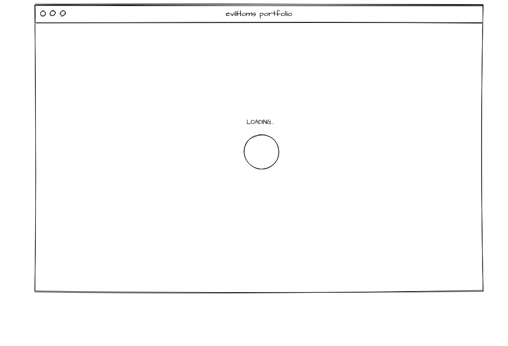
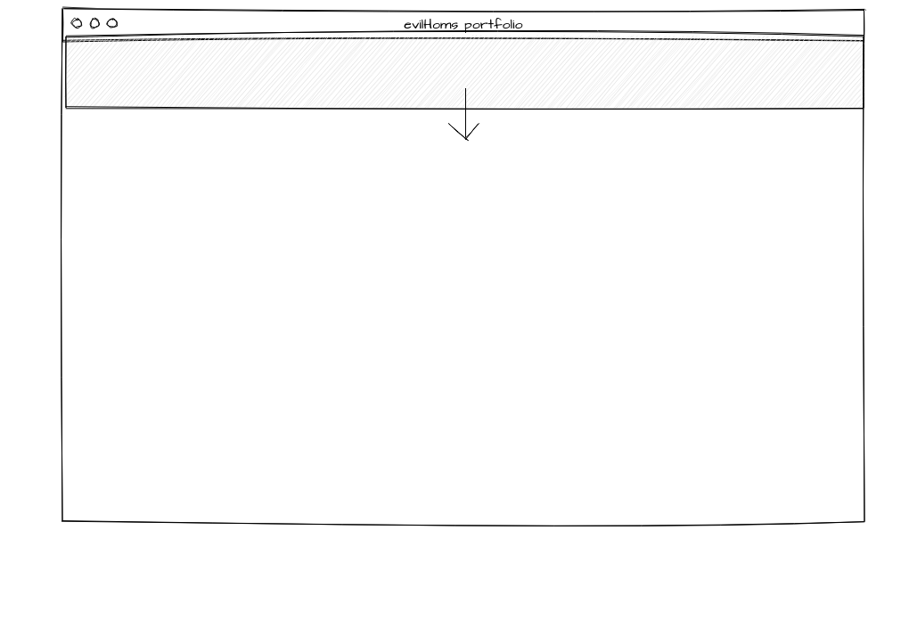
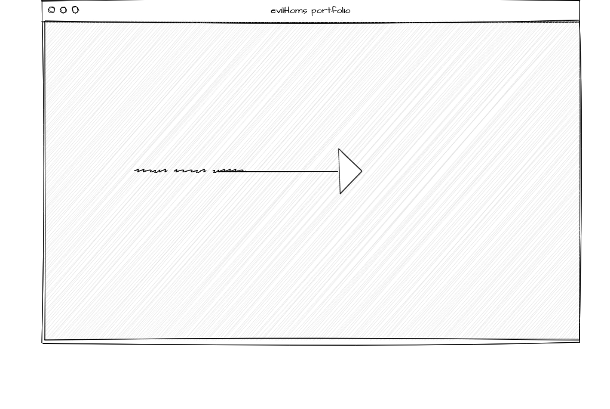
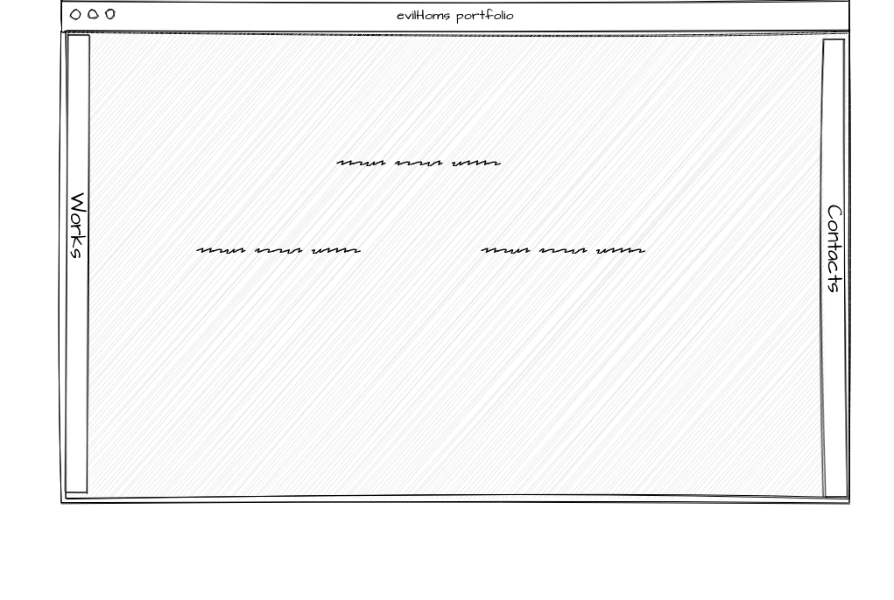

# My portfolio

## General description

Portfolio for my works developed on reactjs.

* First screen is a loader, that will be on screen unteal all resources loaded.

* After all resources loaded, loader disappears, and animation for main screen starts.

* Main block fall down from top of the screen, when it tuch bottom, smoke clouds appears (canvas)

* It bounds twice, then its animation stops
* After that, appears text
  * First block from left and disappears
  * Second from right and disappears
  * Third form top and disappears

* After that all three blocks of text appears on screen

* Then appears side panels from left and right for changing main screen (works, contacts)

* By clicking on them main screen animates and its content changes to works or contact screen

